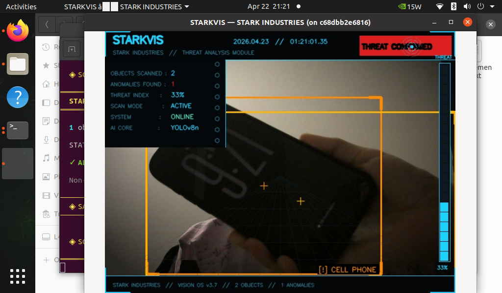
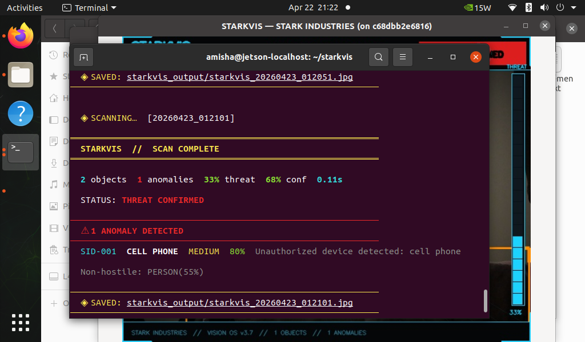
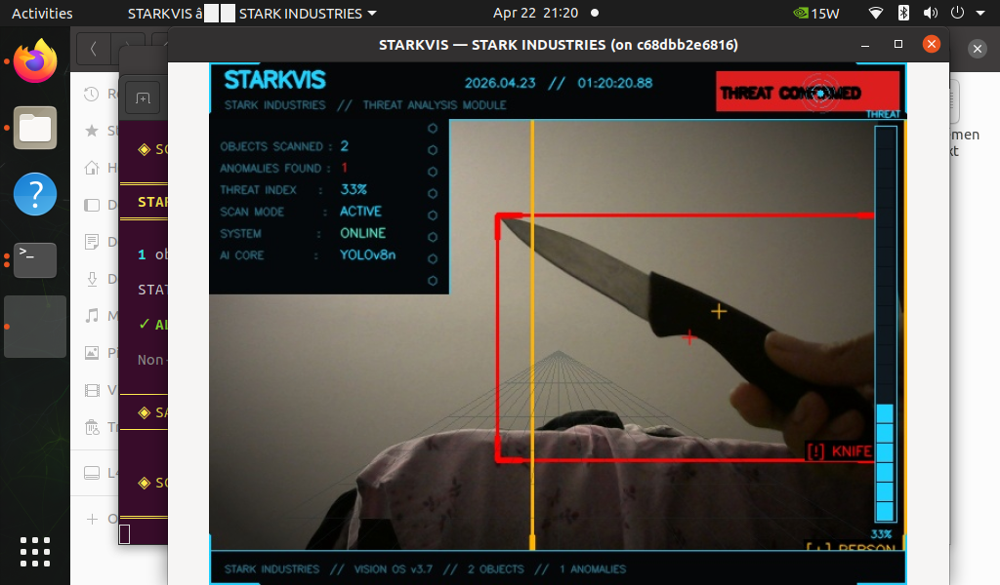
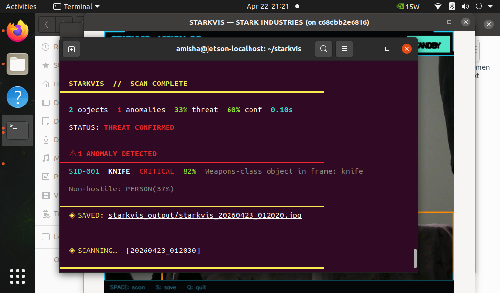

# STARKVIS — Threat Analysis Module
### Stark Industries · Vision OS v3.7 · Iron Man HUD · YOLOv8 + OpenCV

> Real-time object anomaly detector with an **Iron Man / JARVIS aesthetic**  
> Runs on **NVIDIA Jetson** via USB camera inside Docker  
> **100% Open Source — No API Key Required**

---

## Screenshots

### Live Terminal Output


### Annotated Output — Iron Man HUD


### Live Terminal Output




### Annotated Output — Iron Man HUD



---

## Features

- **YOLOv8n** object detection — runs on Jetson GPU, no internet after first run
- **Smooth live camera feed** — dedicated `FrameReader` thread keeps feed running at 30fps even during inference
- **Iron Man HUD overlay** — corner brackets, crosshair reticles, arc reactor decorations, perspective grid, amber color grading
- **Zero-freeze architecture** — inference runs in background thread, display never blocks
- **Labels at bottom-right** of each bounding box with dark backing for readability
- **Pure ANSI terminal UI** — no `rich` dependency, works over SSH
- **Docker containerized** — no dependency conflicts on Jetson

---

## Aesthetic — Iron Man / JARVIS Theme

| Element | Design |
|---------|--------|
| Color palette | Arc reactor blue-white · Stark gold · danger red · warn orange |
| Bounding boxes | Solid border + L-corner brackets + center crosshair |
| Label position | Bottom-right corner of each box with black backing |
| Color grading | Warm amber highlights + cool blue shadows + vignette |
| Decorations | Arc reactor circles · hexagonal markers · perspective floor grid |
| Terminal | Pure ANSI escape codes — zero extra dependencies |

---

## Tech Stack

| Component | Technology |
|-----------|------------|
| Object Detection | YOLOv8n (Ultralytics 8.0.196) |
| Computer Vision | OpenCV (system python3-opencv) |
| Threading | Python `threading` — FrameReader + scan worker |
| Container | Docker · NVIDIA L4T PyTorch r35.2.1 |
| Hardware | NVIDIA Jetson + USB Camera (/dev/video0) |

---

## Project Structure

```
starkvis/
├── detector.py       — YOLOv8 pipeline + Iron Man HUD renderer
├── camera.py         — Jetson USB camera · live feed · FrameReader thread
├── demo_output.py    — Generate sample annotated image (no camera needed)
├── Dockerfile        — Container build
├── requirements.txt  — Python dependencies
└── README.md
```

---

## Architecture — Zero Freeze Design

```
┌─────────────────────────────────────────────────────┐
│  FrameReader Thread  (always running)                │
│  cap.read() in tight loop → stores latest frame      │
└────────────────────────┬────────────────────────────┘
                         │ reader.get() — instant
┌────────────────────────▼────────────────────────────┐
│  Main Display Loop  (30fps, never blocks)            │
│  draw_live_overlay() → cv2.imshow() → waitKey(1)     │
│                                                      │
│  SPACE / auto-interval → spawn scan thread           │
└────────────────────────┬────────────────────────────┘
                         │ frame.copy() passed in
┌────────────────────────▼────────────────────────────┐
│  Scan Worker Thread  (background, non-blocking)      │
│  YOLOv8n inference → render Iron Man HUD → save JPG  │
│  Flash annotated result on display for 4 seconds     │
└─────────────────────────────────────────────────────┘
```

---

## Anomaly Classes

| Severity | Threat Code | Objects |
|----------|-------------|---------|
| `CRITICAL` | `WEAPONS-LOCK` | knife · gun · pistol · rifle · fire |
| `HIGH` | `THREAT-ALPHA` | scissors · smoke · baseball bat |
| `MEDIUM` | `SIGNAL-TRACE` | cell phone · remote |
| `MEDIUM` | `BIO-ANOMALY` | bear · elephant · zebra · giraffe |
| Normal | — | person · chair · car · etc |

---

## Setup & Installation

### Prerequisites
- NVIDIA Jetson (Nano / Xavier / Orin) with JetPack 5.x
- USB Camera connected to `/dev/video0`
- Docker installed

### 1. Clone the repo
```bash
git clone https://github.com/HEX027/starkvis
cd starkvis
```

### 2. Fix Python 3.8 type hint
```bash
python3 -c "
content = open('detector.py').read()
content = content.replace('-> tuple[bool, str, str]', '-> tuple')
open('detector.py', 'w').write(content)
print('Fixed!')
"
```

### 3. Build Docker image
```bash
docker build -t starkvis .
```
> First build ~10–15 min — downloads L4T PyTorch base + YOLOv8 weights

### 4. Allow display + create output folder
```bash
xhost +local:docker
mkdir -p ~/starkvis/output
```

### 5. Run with live window
```bash
docker run --runtime nvidia \
  --device /dev/video0 \
  -e DISPLAY=$DISPLAY \
  -v /tmp/.X11-unix:/tmp/.X11-unix \
  -v ~/starkvis/output:/app/starkvis_output \
  starkvis python3 camera.py live --interval 10 --width 640 --height 480
```

### 6. Run headless (SSH / no monitor)
```bash
docker run --runtime nvidia \
  --device /dev/video0 \
  -v ~/starkvis/output:/app/starkvis_output \
  starkvis python3 camera.py live --headless --interval 15
```

---

## Keyboard Controls

| Key | Action |
|-----|--------|
| `SPACE` | Trigger scan immediately |
| `S` | Save raw camera frame |
| `Q` / `ESC` | Quit |

---

## Output

Each scan saves an annotated image to `starkvis_output/`:
```
starkvis_output/
└── starkvis_20250422_143201.jpg   ← full Iron Man HUD overlay
```

View on Jetson:
```bash
eog ~/starkvis/output/starkvis_*.jpg
```

---

## Troubleshooting

| Error | Fix |
|-------|-----|
| `Cannot open camera` | Try `--camera 1` (CSI may occupy video0) |
| `--runtime nvidia` error | Use `--gpus all` instead |
| `xhost` error | Run `xhost +local:docker` first |
| Window doesn't open | Make sure monitor is connected before running |
| No space left on device | Run `docker system prune -a` |

---

## GitHub Repository Tags

`yolov8` `object-detection` `anomaly-detection` `jetson` `opencv`
`iron-man` `jarvis` `python` `docker` `computer-vision` `ultralytics`

---

## License

MIT — Free to use, modify, and deploy.

---

*"Systems online. All functions nominal, sir."*  
— STARKVIS · Stark Industries · Vision OS v3.7
